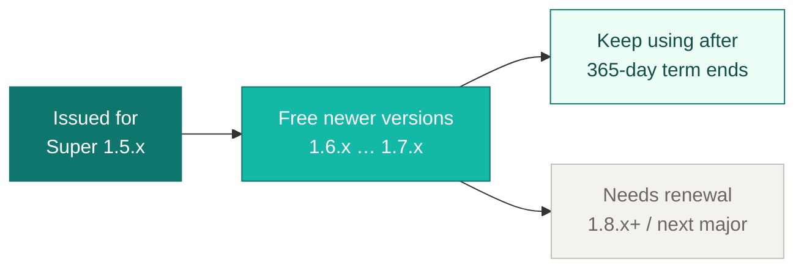

One subscription unlocks the official plugin set on the same **`superd`** / **`super`** binaries you already run. Drop libraries under `$SUPER_ROOT/plugins/`, set `[license].key` (and `auth_secret` for security), then restart — no separate commercial daemon.

| Plugin | What you get |
| :--- | :--- |
| **security** | Bearer auth on the API, RBAC (admin / operator / viewer), immutable audit log. **Required** for any licensed startup. |
| **ui** | Dashboard — process overview, live logs, start/stop, license & metrics when other plugins are active. |
| **notify** | Production alerting: Slack / DingTalk / Feishu / Teams / custom webhooks, channel routing, hot-reload via `conf/notify.toml`, and [storm suppression](/docs/05-advanced-management/event-notifications#storm-suppression) (rate limits + inhibition) so incident bursts do not flood your channels. Complements OSS `[[event_hooks]]`; does not replace them. |
| **isolation** | Linux cgroups v2 CPU/memory limits per program (hot-update without restart). **Linux only.** |

Compare editions in the [feature matrix](/docs/07-editions/feature-matrix/). During public beta you can also request a **[free 90-day Pro trial](https://github.com/schiplat/super/issues/new?template=pro-trial.yml)** (no payment). After purchase or trial fulfillment you receive the plugin archive for your platform, a license key, and a short config snippet (`[license].key` + `auth_secret`).

> [!NOTE] Event hooks vs notify
> OSS already supports local scripts or a basic webhook POST via `[[event_hooks]]`. The **notify** plugin is for multi-channel IM templates, routing, and storm suppression on the *same* event stream — see [Event notifications](/docs/05-advanced-management/event-notifications/) and [Event hooks](/docs/03-orchestration/events/hooks/).

## Checkout



By continuing to checkout you agree to the [Terms of Service](/legal/terms/) and [Privacy Policy](/legal/privacy/).

**Payment is completed on Afdian, a third-party platform.** Super does not process your card or wallet directly. **Refunds and chargebacks follow Afdian’s platform rules**; see [Terms §6](/legal/terms/#6-refunds). Contact **support@ddl.sconts.com** if fulfillment is delayed after payment clears.

Checkout is hosted on a third-party page so we can change payment providers without republishing Super itself. This docs page (`/go/pro/`) stays the stable link from the homepage and docs.

### How to buy

On the checkout page:

1. Choose the **Super Pro** plan (not the open-source supporter tier).
2. Prefer **annual payment** — one annual payment maps to a **365-day** license term.
3. Fill in: display name, OS + arch (e.g. Linux arm64), and email.
4. Delivery is typically within **24 hours** after payment clears.

Open-source supporter tips do **not** include plugins or a license key.

## Customer portal

Existing subscribers: sign in at the **[Super Pro Portal](https://platform.ddl.sconts.com/portal/login)** to download plugin packages for your platform, view license details, and manage renewals.

> [!TIP] Expiry does not disable your plugins
> After the 365-day term ends, you can still use Super Pro plugins on the Super versions your key already authorizes (see below). Expiry does **not** turn plugins off. Renew when you want to follow **newer** Super releases beyond that version scope.

## License version coverage

Your key is **issued for a specific Super release line** at fulfillment. It also **includes free use of newer minor lines up to a signed maximum**.

That version scope stays valid **after the 365-day term**: you may keep running Pro plugins offline on those versions without renewing. What ends at day 365 is not “permission to use Pro,” but the window for **following newer Super lines** (and receiving a new key with a higher max). Beyond the signed maximum — or a new major — renew to get a new key.

### Version timeline

The chart below shows what a key covers (example for a key issued on the **1.5.x** line, matching the current Super release). The green range remains usable **during and after** the 365-day term:



| | What it means |
|---|---|
| **Issued for** | The Super line stamped when your key is created (example: `1.5.x`). |
| **Free newer versions** | Newer minor lines through the signed max (example: `1.6.x` and `1.7.x`) — no extra payment. |
| **After 365 days** | **Still usable** on that same issued→max scope. Plugins are not revoked at expiry. |
| **Needs renewal** | Past the max (example: `1.8.x+`) or a new major — renew to follow newer releases. |

Current policy example: issued minor line **plus two** newer minor lines (`1.5.x` → through `1.7.x`). Your key shows the exact scope.

**Summary:** 365 days is the annual term; the **version scope** is what you keep using afterward. The open-source `superd` / `super` binaries remain usable at any version without plugins.
